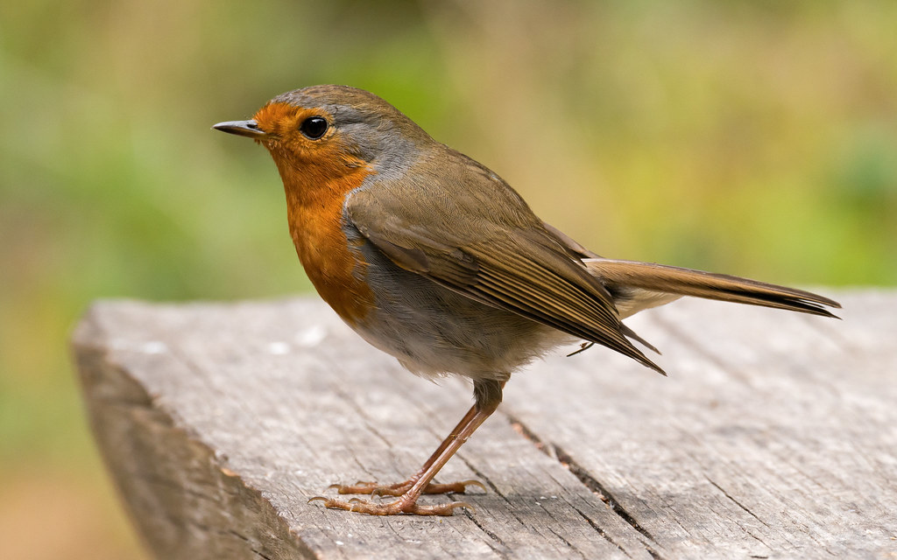
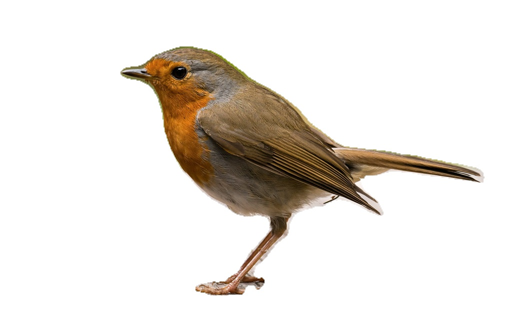
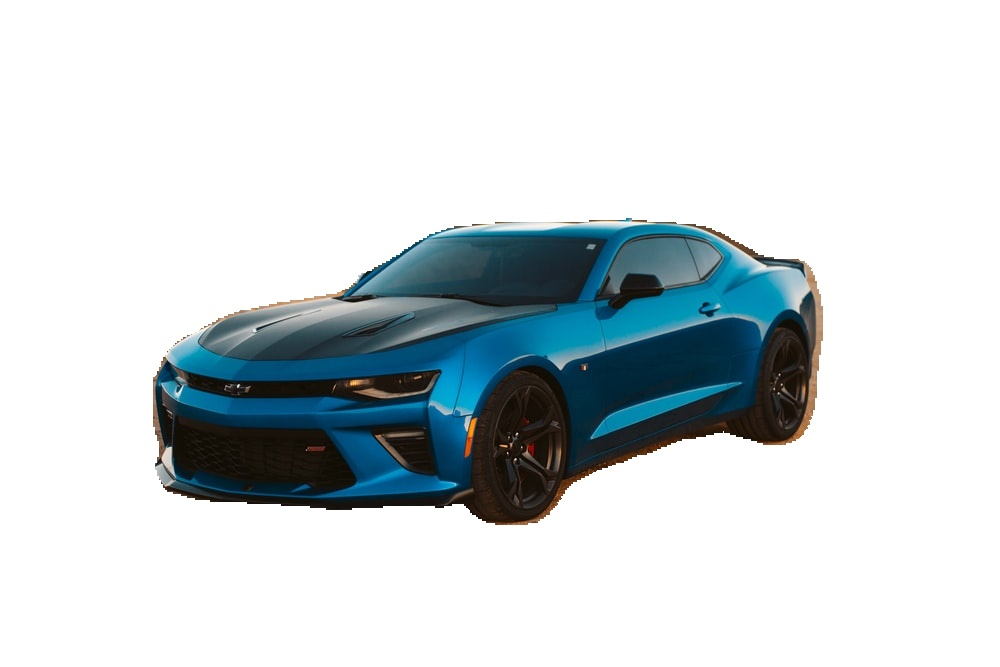

# Remove image Background within few seconds
* Created a python script to remove background from any image using PixelLib Python Library.
* DeepLearning model used is also provided by PixelLib.
* Can be used for any image file type and for any size.
* Accuracy of this script depends on the DL model which performs best when object is well distinguishable from the background.
## Code and Resources Used
**Python version:** 3.8  
**Packages:** numpy, PIL, pixellib, tensorflow, imgaug  
**PixelLib:** https://pixellib.readthedocs.io/en/latest/  
**DL Model:** https://github.com/ayoolaolafenwa/PixelLib/releases/download/1.1/deeplabv3_xception_tf_dim_ordering_tf_kernels.h5  
## Brief Explanation
I have used Python Imaging Library(PIL) to change any image format to jpg format. Created an instance of PixelLib's class alter_bg. Then loaded deeplabv3 model provided by PixelLib and called color_bg function. Color_bg function can be used to change the color of the background of your image using the colors parameter that takes rgb values as input. For us to have only object and no background, the background must be white. So, colors parameter is set to white in the above script. The script will return a output file path which is set to outputs folder.
The accuracy of this script depends on the amount of different objects present in the background, the size of the main object, the size of the image, etc. but, most of the time it is quite accurate.
## Results
**With Background**  
    
**Without Background**  
    
**With Background**  
    
**Without Background**  
    
**With Background**  
    
**Without Background**  
    
If want to see some other transformation there are some other images in demo folders.  
As we can see, it successfully removes background from any type of image as long as the main object is clear.
